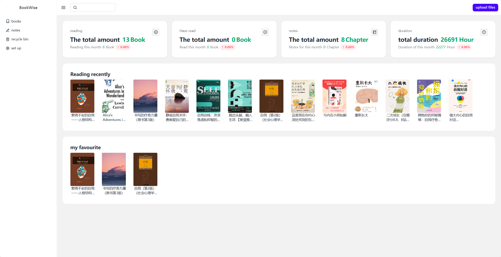
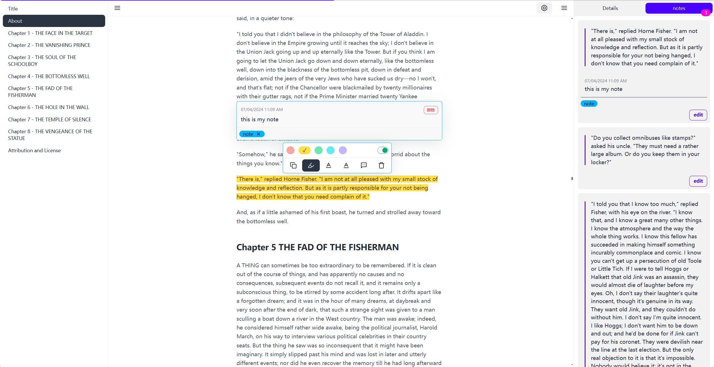
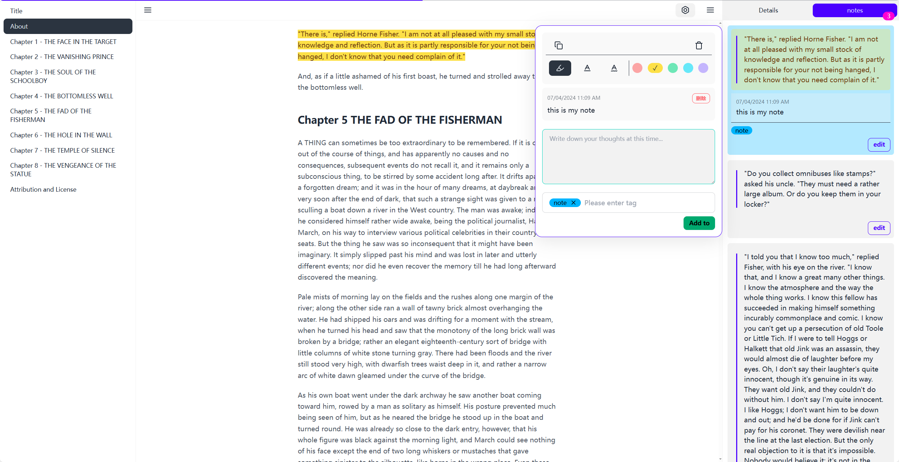
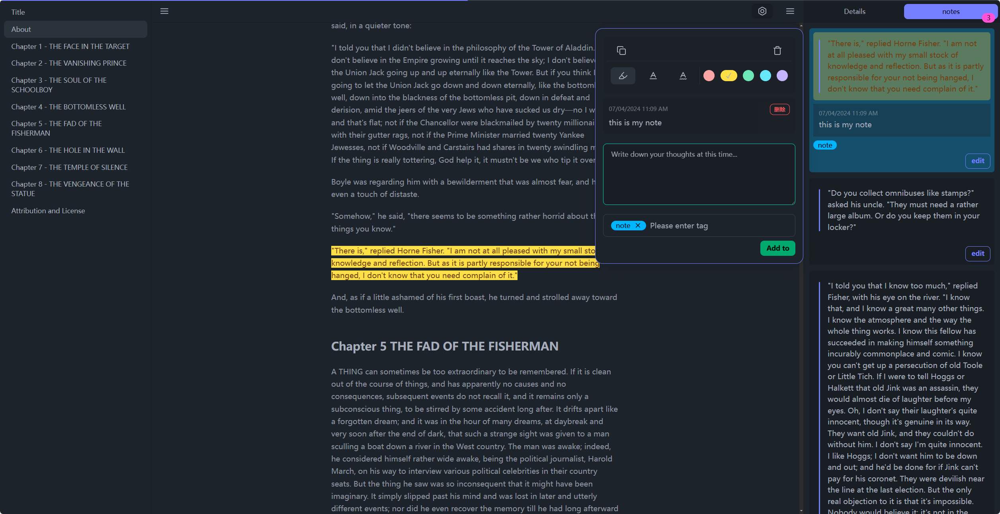
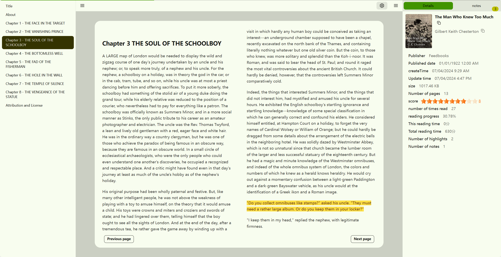
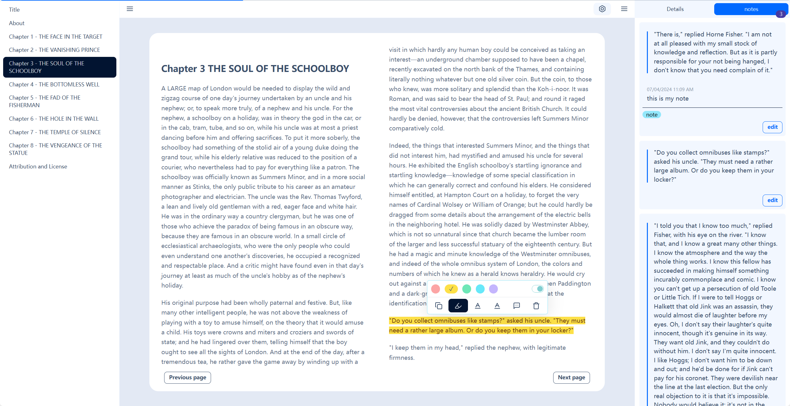

  

<h1 align="center">
  Bookwise Reader
</h1>

<h3 align="center">
  A modern | free | cross-platform | beautiful themes  e-book reader
</h3>

**English** · [简体中文](./README.zh_CN.md) · <a href="https://buzhifanji.github.io/BookWise/" target="_blank">Oneline</a> · [Download](https://github.com/Buzhifanji/BookWise/releases/latest)

## Preview

   
  

    <kbd>
      
    </kbd>
  

   
  

    <kbd>
      
    </kbd>
  

   
  

    <kbd>
      
    </kbd>
  

   
  

    <kbd>
      
    </kbd>
  

  

    <kbd>
      
    </kbd>
  

  

    <kbd>
      
    </kbd>
  

   

## Feature

## Features

- Supported Reading Formats:
  - EPUB (**.epub**)
  - PDF (**.pdf**)
  - DRM-free Mobipocket (**.mobi**) and Kindle (**.azw3**, **.azw**)
  - FictionBook (**.fb2**)
  - TXT: <kbd>Upcoming</kbd>
  - HTML: <kbd>Upcoming</kbd>
  - DOC: <kbd>Under Consideration</kbd>
- Supported Platforms: **Windows**, **macOS**, **Linux**, and **Web**
- Themes: 32 built-in themes

- Reader
  - Reading Modes: Scrolling mode, Section mode, Two-column mode
  - [Auto Typesetting](https://github.com/tailwindlabs/tailwindcss-typography), Customizable font size, margins
  - Custom fonts: <kbd>Upcoming</kbd>
  - Copy functionality
  - Translation feature: <kbd>Upcoming</kbd>
  - Auto-scroll reading: <kbd>Under Consideration</kbd>
  - Text-to-speech: <kbd>Upcoming</kbd>
  - Page-turning features
    - Previous page: Left arrow; Next page: Right arrow
    - Scroll up slightly: Up arrow; Scroll down slightly: Down arrow
      - Scroll up or down by one paragraph: <kbd>Needs Improvement</kbd>
  - Table of contents: Automatically records the current reading table of contents
  - Word highlighting
    - Auto-highlight: Default on, can be turned off
    - Double-click to highlight an entire paragraph
    - Marker, Straight line, Wavy line
  - Notes
    - Add (supporting multiple), Edit, Delete, View
    - Note list displays notes corresponding to the current table of contents: <kbd>Upcoming</kbd>
    - Note count statistics
  - Tags: Support for multiple tags
  - Record reading position: Default on, can be turned off
  - Record reading count
  - Record reading duration:
    - Detailed record of each reading session, accurate to minutes
    - Total reading time
  - Search
    - Book content search: <kbd>Upcoming</kbd>
    - Search engine search: <kbd>Upcoming</kbd>
- Book Management
  - Modes: Bookshelf mode, Card mode, List mode
  - Search: <kbd>Upcoming</kbd>
  - Sorting: adding time, reading time, reading progress, reading duration, book title, author, rating
  - Filtering: bookshelf
  - Support for editing book title, author, cover
  - Custom ratings
  - Custom bookshelf categories
  - Favorite collection feature
  - Recycle bin feature: Default on, can be turned off
  - Book status: <kbd>Upcoming</kbd>
  - Review feature: <kbd>Upcoming</kbd>
  - Shortcut keys: <kbd>Upcoming</kbd>
- Note Management
  - Search: <kbd>Upcoming</kbd>
  - Sorting: Time-based sorting, Book title sorting
  - Filtering
    - Book title filter (single book)
    - Tag filter (multiple tags): <kbd>Upcoming</kbd>
  - Modes:
    - Card mode
    - List mode: <kbd>Upcoming</kbd>
  - Jump to source
  - Shortcut keys: <kbd>Upcoming</kbd>
- Upload: Supports drag and drop, multi-file upload
- Tag Management
  - One-click clear for tags not bound to notes: <kbd>Upcoming</kbd>
  - Nested tags: <kbd>Under Consideration</kbd>
- Bookshelf Management
  - One-click clear for empty bookshelves: <kbd>Upcoming</kbd>
- Idle mode: <kbd>Upcoming</kbd>
- Cloud synchronization feature: <kbd>Upcoming</kbd>
- Backup feature: <kbd>Upcoming</kbd>
- Global search: <kbd>Upcoming</kbd>