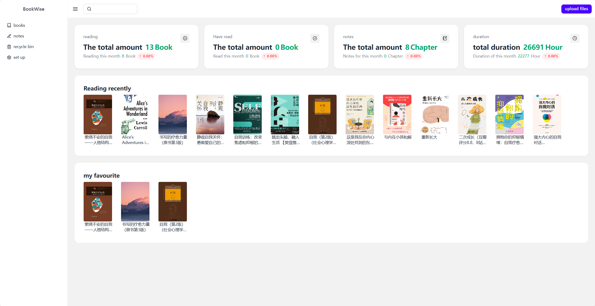
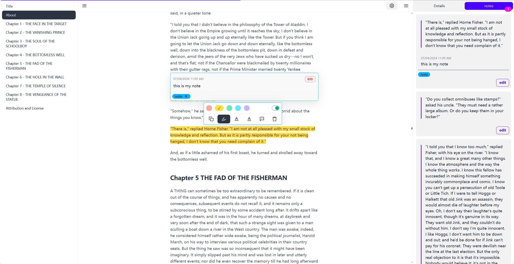
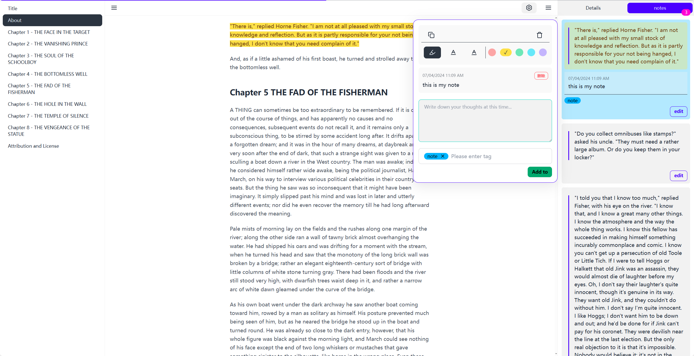
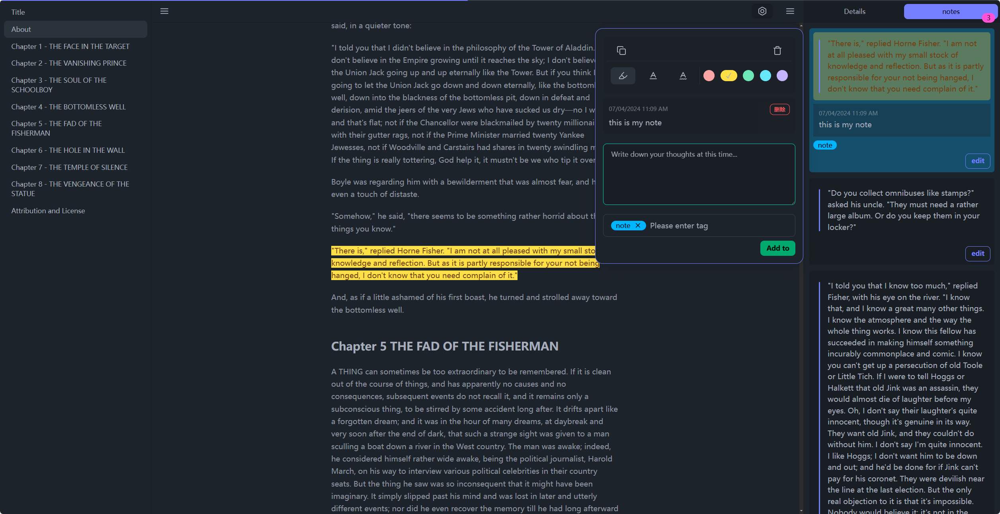

  

<h1 align="center">
  Bookwise Reader
</h1>

<h3 align="center">
  现代 | 免费 | 跨平台 | 精美主题 电子书阅读器
</h3>

<a href="./README.md">简体中文</a> · 
**简体中文** · 
<a href="https://buzhifanji.github.io/BookWise/" target="_blank">网页在线版</a> · 
<a href="https://github.com/Buzhifanji/BookWise/releases/latest" >下载</a> 

## 预览

   
  

    <kbd>
      
    </kbd>
  

   
  

    <kbd>
      
    </kbd>
  

   
  

    <kbd>
      
    </kbd>
  

   
  

    <kbd>
      
    </kbd>
  

   

## 特色

- 支持阅读格式：
  - EPUB (**.epub**)
  - PDF (**.pdf**)
  - DRM-free Mobipocket (**.mobi**) and Kindle (**.azw3**, **.azw**)
  - FictionBook (**.fb2**)
- 支持平台: **Windows**, **macOS**, **Linux** and **Web**
- 阅读模式：滚动模式、章节模式、双栏模式
- 主题：内置32种主题
- 笔记：添加笔记，高亮，标签
- 阅读时间：记录阅读时间
  