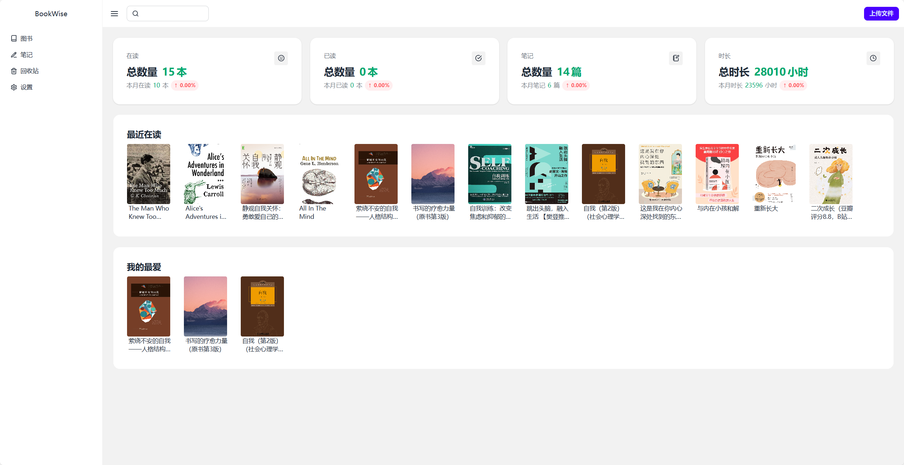
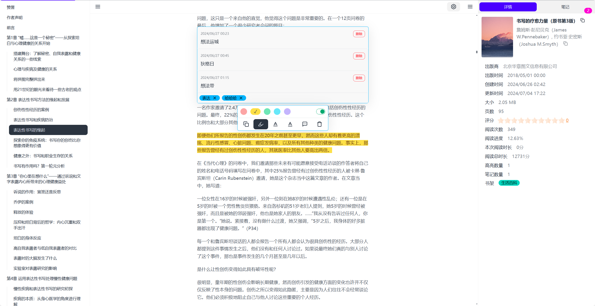
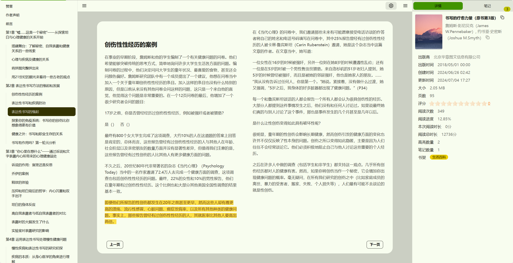

  

<h1 align="center">
  Bookwise Reader
</h1>

<h3 align="center">
  现代 | 免费 | 跨平台 | 精美主题 电子书阅读器
</h3>

<a href="./README.md">English</a> · 
**简体中文** · 
<a href="https://buzhifanji.github.io/BookWise/" target="_blank">网页在线版</a> · 
<a href="https://github.com/Buzhifanji/BookWise/releases/latest" >下载</a> 

## 预览

   
  

    <kbd>
      
    </kbd>
  

   
  

    <kbd>
      
    </kbd>
  

   
  

    <kbd>
      
    </kbd>
  

   
  

    <kbd>
      
    </kbd>
  

  

    <kbd>
      
    </kbd>
  

  

    <kbd>
      
    </kbd>
  

   

## 特色

- 支持阅读格式：
  - EPUB (**.epub**)
  - PDF (**.pdf**)
  - DRM-free Mobipocket (**.mobi**) and Kindle (**.azw3**, **.azw**)
  - FictionBook (**.fb2**)
  - TXT: <kbd>待实现</kbd>
  - HTML: <kbd>待实现</kbd>
  - DOC: <kbd>考虑中</kbd>
- 支持平台: **Windows**, **macOS**, **Linux** and **Web**
- 主题：内置32种主题

- 阅读器
  - 阅读模式：滚动模式、章节模式、双栏模式
  - [自动排版](https://github.com/tailwindlabs/tailwindcss-typography)、自定义字体大小、边距
  - 自定义字体：<kbd>待实现</kbd>
  - 复制功能
  - 翻译功能：<kbd>待实现</kbd>
  - 自动滑动阅读：<kbd>待考虑</kbd>
  - 朗读功能：<kbd>待实现</kbd>
  - 翻页功能
    - 上一页：左箭头；下一页：右箭头
    - 上滑一点点：上箭头；下滑一点点：下箭头
      - 上下滑一个段落：<kbd>待改进</kbd>
  - 目录：自动记录当前阅读目录
  - 划词高亮
    - 自动高亮：默认打开、可关闭
    - 双击整个段落高亮
    - 马克笔、直线、波浪线
  - 笔记
    - 添加（支持多条）、编辑、删除、查看
    - 笔记列表展示当前目录对应的笔记内容： <kbd>待实现</kbd>
    - 统计笔记数量
  - 标签：支持多标签
  - 记录阅读位置：默认打开，可关闭
  - 记录阅读次数
  - 记录阅读时长：
    - 详细记录每次阅读时长、精确到分钟
    - 阅读总时长
  - 搜索
    - 书籍内容搜索：<kbd>待实现</kbd>
    - 搜索引擎搜索：<kbd>待实现</kbd>
- 书籍管理
  - 模式：书架模式、卡片模式、列表模式
  - 搜索：<kbd>待实现</kbd>
  - 排序：<kbd>待实现</kbd>
  - 过滤：<kbd>待实现</kbd>
  - 支持编辑书名、作者、封面
  - 自定义评分
  - 自定义书架分类
  - 喜爱收藏功能
  - 回收站功能：默认打开、可关闭
  - 书籍状态：<kbd>待实现</kbd>
  - 观后感功能：<kbd>待实现</kbd>
  - 快捷键功能：<kbd>待实现</kbd>
- 笔记管理
  - 搜索：<kbd>待实现</kbd>
  - 排序：时间排序、书名排序
  - 过滤
    - 书名过滤（单本）
    - 标签过滤（多标签）：<kbd>待实现</kbd>
  - 模式：
    - 卡片模式
    - 列表模式：<kbd>待实现</kbd>
  - 跳转到出处
  - 快捷键：<kbd>待实现</kbd>
- 上传：支持拖到、多文件上传
- 标签管理
  - 一键清空未绑定笔记的标签：<kbd>待实现</kbd>
  - 嵌套标签：<kbd>待考虑</kbd>
- 书架管理
  - 一键清空空书架：<kbd>待实现</kbd>
- 摸鱼模式：<kbd>待实现</kbd>
- 网盘同步功能：<kbd>待实现</kbd>
- 备份功能：<kbd>待实现</kbd>
- 全局搜索：<kbd>待实现</kbd>